# Contribution Guidance

## How Git works
Here is a basic overview of how Git works:

* Create a "repository" (project) with a git hosting tool (like Bitbucket)
* Copy (or clone) the repository to your local machine
* Add a file to your local repo and "commit" (save) the changes
* "Push" your changes to your master branch
* Make a change to your file with a git hosting tool and commit
* "Pull" the changes to your local machine
* Create a "branch" (version), make a change, commit the change
* Open a "pull request" (propose changes to the master branch)
* "Merge" your branch to the master branch

from https://www.atlassian.com/git

## Πρώτος Τρόπος GitHub

### 1. Κάνουμε fork το repository του γενικού (μια φορά)

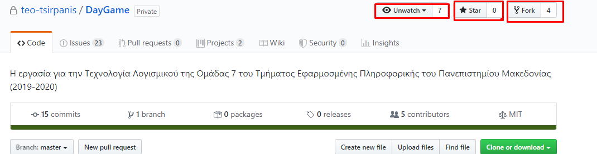

### 2. Ανεβάζουμε τον κώδικά μας στο fork (έχει το όνομά μας μπροστά)
Κάνουμε upload files και πατάμε commit. Τώρα ο κώδικας αυτός είναι μόνο στο δικό μας repository. Για να πάει στο γενικό repository κάνουμε το 3

### 3. Κάνουμε Pull Request
Μας πηγαίνει στο repository του γενικού εκεί προσέχουμε να έχουμε ως base repository τo γενικό και head το δικό μας. Πατάμε Pull request

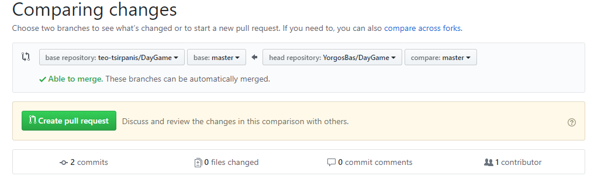

### 4. Περιμένουμε έλεγχο για των κώδικα
Ο κώδικά σας θα εξεταστεί για πιθανά bugs

### 5. Έγκριση κώδικα (merge)
Ο κώδικας εγκρίθηκε και ανέβηκε στο γενικό repository

## Ανανέωση κώδικα
Όταν ανεβάζουν πολλά άτομα κώδικα στο γενικό, το δικό μας repository δεν ανανεώνεται αυτόματα και μένει πίσω. Για να έχουμε την τελευταία έκδοση του κώδικα κάνουμε:

### 1. Πηγαίνουμε στο δικό μας fork
Βλέπουμε ότι είμαστε πίσω σε commit. Πατάμε Pull Request

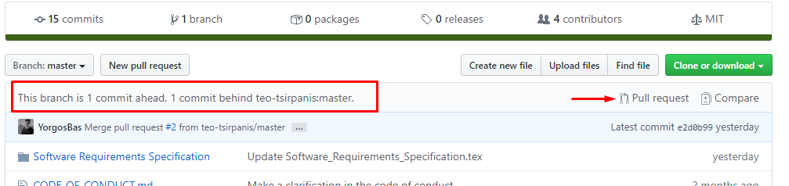

### 2. Κάνουμε Pull Request
Προσέχουμε ως base repository να είναι το δικό μας και head του γενικού. Πατάμε Pull Request

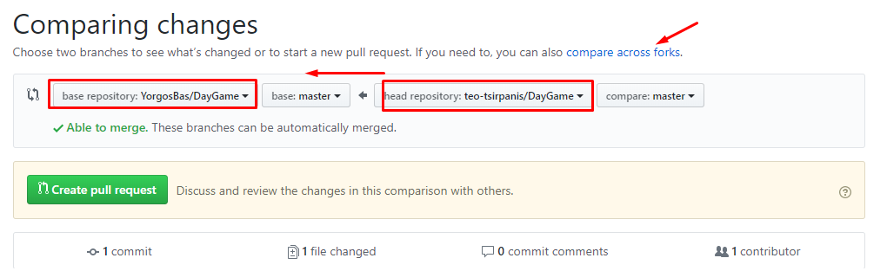

### 3. Επιτυχία (merge)
Τώρα θα λέει ότι είμαστε μπροστά. Δεν μας πειράζει απλώς συγκρίνει τον αριθμό των commits. Ο κώδικας είναι μια χαρά

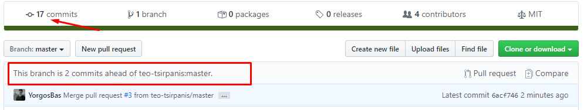

## Δεύτερος Τρόπος μέσω προγράμματος Source Tree ή IDE
Καλύπτεται JetBrains και Source Tree, ωστόσο άμα καταλάβετε την φιλοσοφία μπορείται να διαχειριστείται τα πάντα

## Source Tree

## 1. Clone 
Κάνουμε clone το repository είτε το γενικό είτε το fork μας. Ανάλογα πως δουλεύει κάθε ομάδα

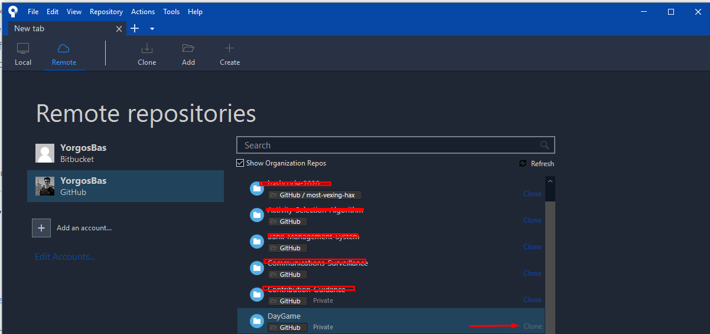

## 2. Commit
Γράφουμε κώδικα και μόλις τελειώσουμε εμφανίζονται οι αλλαγές στο File Status. Πατάμε Stage όσα θέλουμε, γράφουμε ένα μήνυμα και commit

## 3. Push στο fork
Οι αλλαγές έγιναν τοπικά άρα για να ενημερωθεί το repository στο github πατάμε Push, επιλέγουμε το δικό μας repository (origin), το branch και πατάμε Push

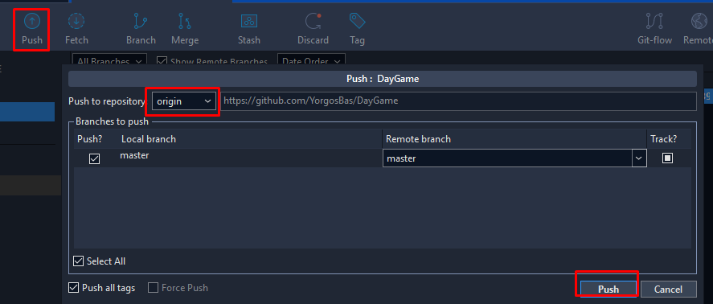

## Pull από fork
Αν θέλουμε να πάρουμε κάποιες αλλαγές που έγιναν στο fork κάνουμε Pull

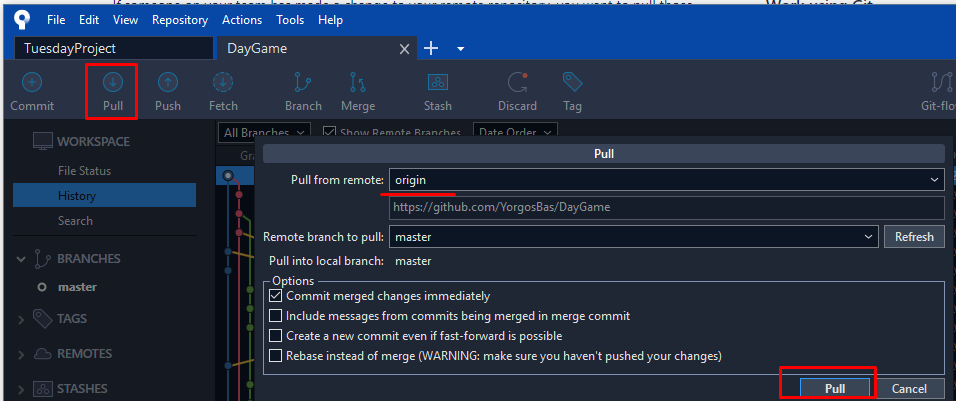

## Pull στο γενικό
Για να πάρουμε την τελευταία έκδοση του κώδικα από το γενικό repository (από εκεί που κάναμε fork), επιλέγουμε settings και βάζουμε το γενικό repository με ένα όνομα δικό μας (συνήθως master) και το λινκ

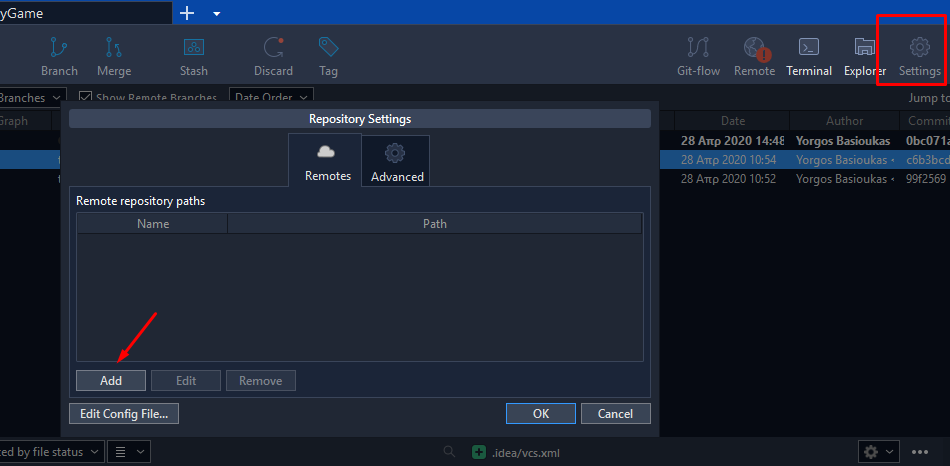
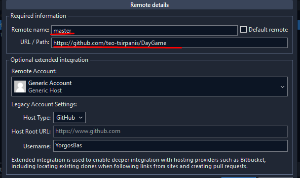
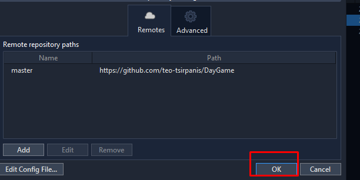
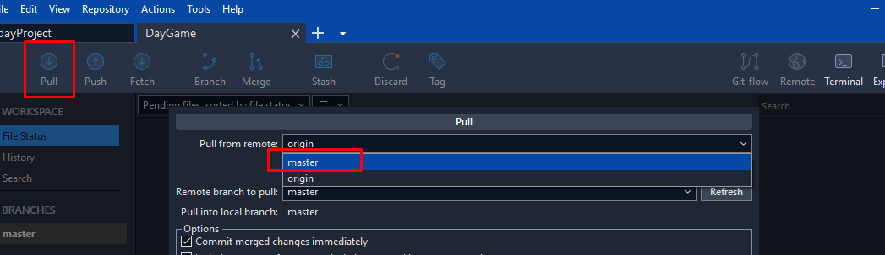
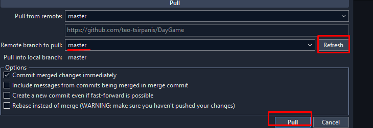

## Push από γενικό
Εφόσον βάλαμε το γενικό από τα settings μπορούμε να ανεβάσουμε ένα δικό μας κομμάτι κώδικα στο γενικό

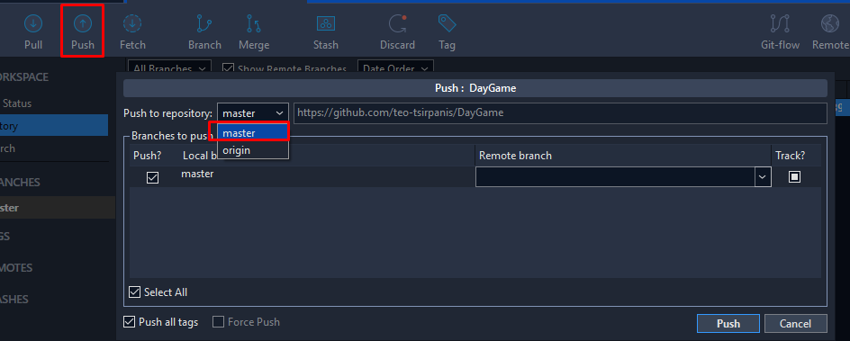

## Pull Requests
Τα pull request γίνονται μέσω web ωστόσο υπάρχει η επιλογή να δημιουργηθεί στο gui

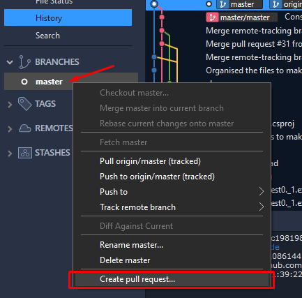

## IDE 
Πολλά προγράμματα ide προσφέρουν integration με GitHub. Ο παρακάτω τρόπος είναι για προγράμματα JetBrains. Παρόμοια και σε υπόλοιπα

### 1. Set-Up
Πηγαίνουμε File -> settings -> version control -> GitHub και βάζουμε τον λογαριασμό μας

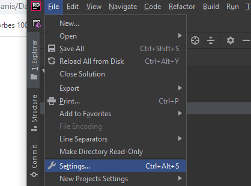
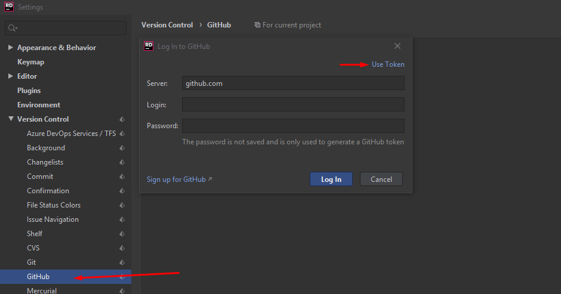

### 2. Clone
Εφόσον κάναμε fork το γενικό repository μπορούμε τώρα να το κάνουμε clone και να το έχουμε τοπικά στον υπολογιστή μας

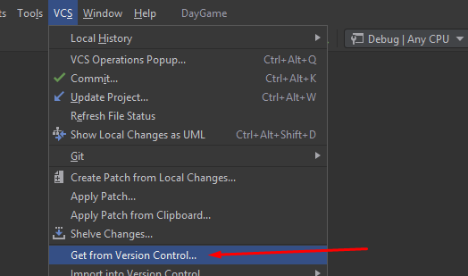
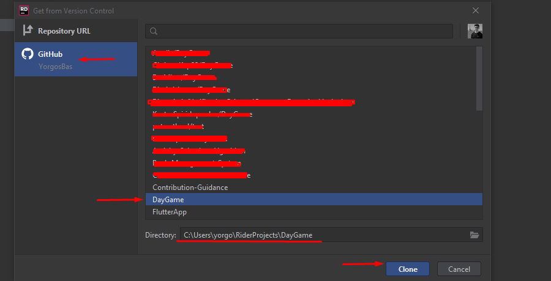

### 3. Commit
Γράφουμε κώδικα και όταν τελειώσουμε κάνουμε τοπικά commit, γράφουμε ένα σχόλιο και μας εμφανίζει τον γράφο της συνεισφοράς

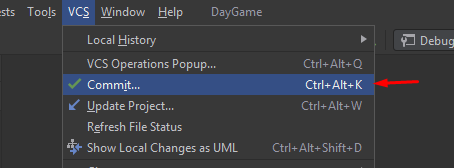
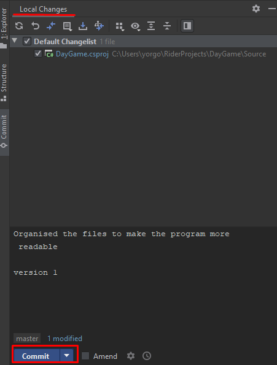
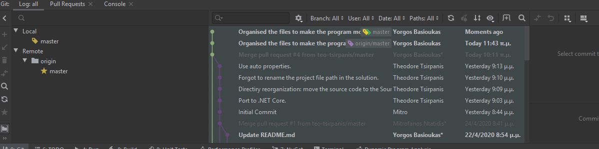

### 4. Push
Οι αλλαγές όπως είπαμε έγιναν τοπικά. Για να ανεβούν στο github πηγαίνουμε VCS -> VCS operations -> push

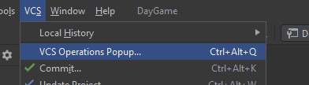
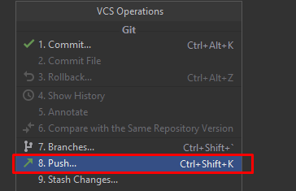
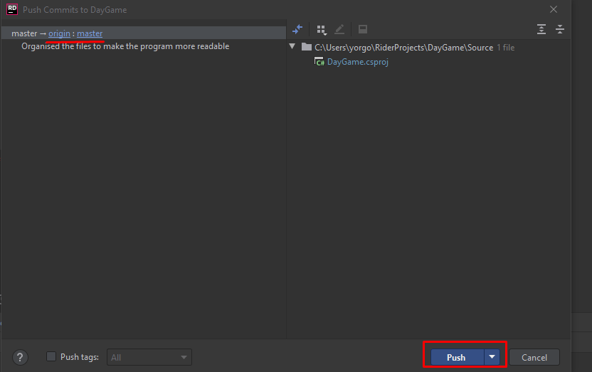
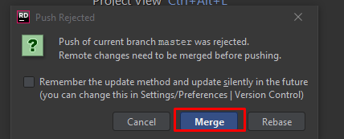

### 5. Επιτυχία
Αν ανανεώσουμε το github repository θα υπάρχουν οι αλλαγές. Τώρα είτε ακολουθούμε βήμα τρία απο τον πρώτο για Pull request είτε απο το IDE επιλέγουμε

VCS -> Git -> Create Pull Request και επιλέγουμε το repository που θέλουμε να κάνουμε

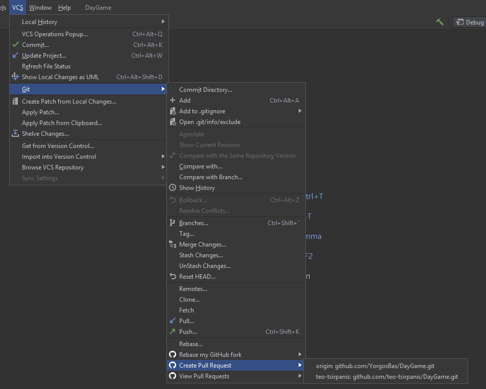

## Ανανέωση κώδικα
Όταν ανεβάζουν πολλά άτομα κώδικα στο γενικό, το δικό μας repository δεν ανανεώνεται αυτόματα και μένει πίσω. Για να έχουμε την τελευταία έκδοση του κώδικα κάνουμε:

### 1. Pull από το γενικό 
Αρχικά παίρνουμε τις αλλαγές που έκαναν κάποιοι developers από το γενικό στο δικό μας κώδικα τοπικά

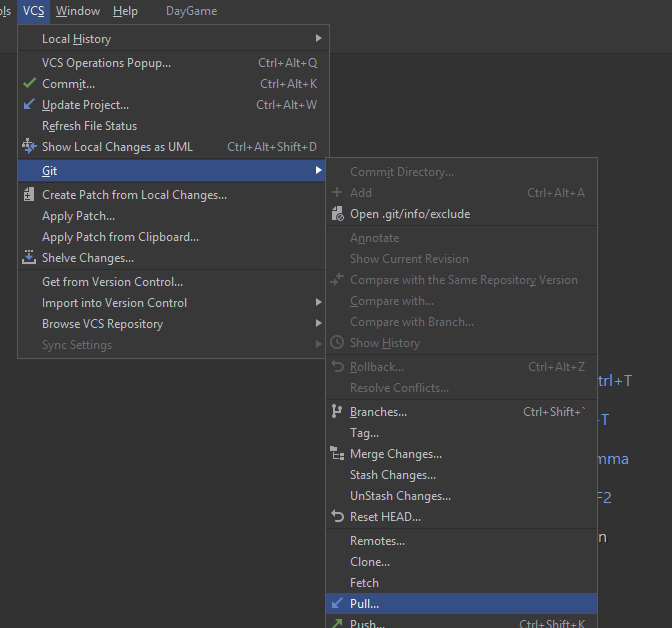
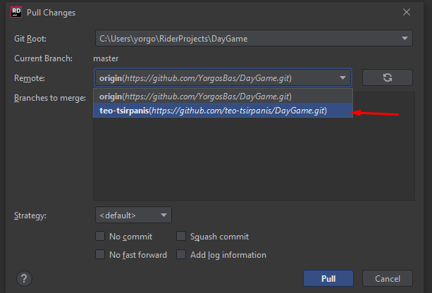

### 2. Push στο δικό μας
Ακολουθούμε βήμα 4 απο τον δεύτερο τρόπο κάνοντας push στο δικό μας repository

### Notable Mention: Pull από το δικό μας repository
To Update Project κάνει pull απο το repository μας όχι απο το γενικό.

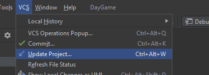
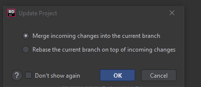

#### Conflict
αμα κάτι δεν πάει καλά θα βγει conflict. Πατάμε πάνω στα αρχεία και μετά επιλέγουμε πιο θα κρατήσουμε

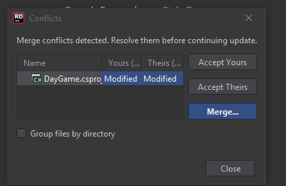
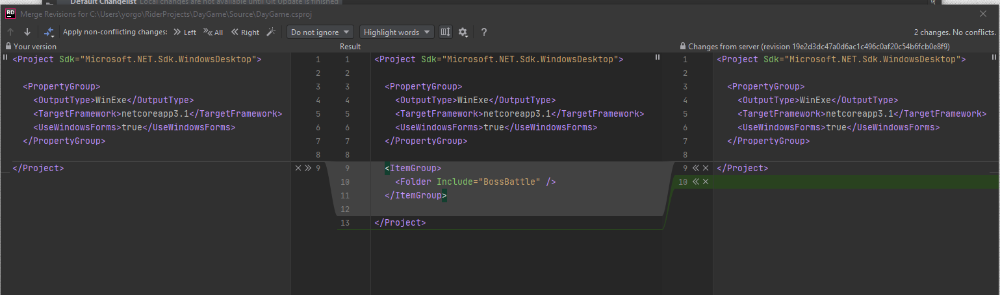

## Source Tree

## Git
Για όσους θέλουν να μάθουν git (ευκαιρία είναι) τα βήματα πάνω θα γίνονται με command line. https://www.atlassian.com/git

## Disclaimer
Η δικιά μας ομάδας δουλεύει με ένα γενικό repository και κάθε άτομο το έχει κάνει fork. Ενδεχομένος να μην χρειαστεί να κάνετε fork και να δουλεύετε μόνο με ένα γενικό και άρα όλες οι αλλαγές να γίνονται εκεί. 
